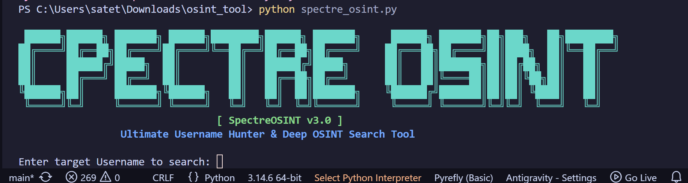
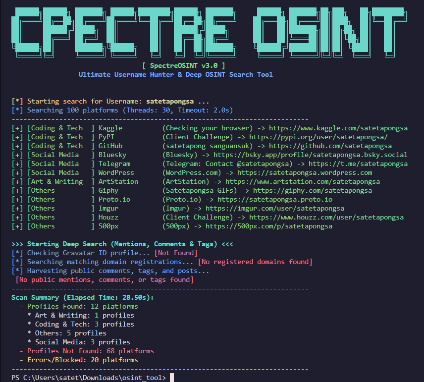

# SpectreOSINT



**SpectreOSINT** is a high-fidelity, advanced command-line OSINT tool designed for exact username scanning across 17 targeted digital platforms. It focuses on finding real, verified profiles and harvesting direct, clickable links without showing false positives or unneeded metadata.

---

## Key Features

- **17 Targeted Platforms:** Focused search across key social, professional, gaming, coding, and reference networks.
- **100% Exact Matching:** Incorporates advanced validation rules (redirect checks, soft-404 text parsing, page title, and meta description comparisons) to eliminate false positives.
- **Instagram Smart Check:** Features an Instagram scraping engine with automatic web-viewer fallbacks (Dumpor/Tikvib) to bypass Instagram's login walls.
- **Smart Surname/Name Search:** Supports target identification using first and last name formats (`name_surname`), automatically expanding the search across multiple username variations.
- **Zero Output Noise:** Only prints found profiles. Automatically filters out any rate limits, blocks, or "not found" profiles for clean console reports.

---

### Supported Platforms Overview

| Category | Platforms |
|----------|-----------|
| Social Media | Instagram, Facebook, TikTok, Twitter/X, LinkedIn, Pinterest, Telegram, Linktree, Gmail |
| Coding & Tech | GitHub |
| Gaming & Communities | Steam, Twitch, Roblox, Chess.com |
| Audio & Video | YouTube, Spotify, SoundCloud |
| Knowledge & Reference | Wikipedia |

---

## Installation & Setup

1. Clone the repository:
   ```bash
   git clone https://github.com/satetapongsa/SpectreOSINT.git
   cd osint_tool
   ```

2. Install the dependencies:
   ```bash
   pip install requests beautifulsoup4
   ```

---

## How to Use

Run the script by passing the target username or name/surname as an argument:

### 1. Username Search (Normal)
If you enter a single username, it checks for that exact profile name on all platforms.
```bash
python spectre_osint.py saksorn
```

### 2. Specific Surname Search (name_surname)
If you enter a name and surname separated by an underscore (`_`), the tool will automatically check **3 common username variations** to locate the target's profiles regardless of the platform's format:
*   `first_last` (e.g. `satetapong_sanguansuk`)
*   `firstlast` (e.g. `satetapongsanguansuk`)
*   `first.last` (e.g. `satetapong.sanguansuk`)

```bash
python spectre_osint.py satetapong_sanguansuk
```

#### Sample Surname Search Output:
```text
[*] Starting search for Username: satetapong_sanguansuk ...
[*] Detected name_surname pattern. Scanning 3 variations: satetapong_sanguansuk, satetapongsanguansuk, satetapong.sanguansuk
[*] Searching 18 platforms across 3 username variations (Threads: 20, Timeout: 4.0s)
---------------------------------------------------------------------------
[+] [Social Media   ] Instagram       [satetapong.sanguansuk] (Satetapong Sanguansuk) -> https://www.instagram.com/satetapong.sanguansuk/
[+] [Social Media   ] LinkedIn        [satetapong_sanguansuk] (Satetapong Sanguansuk) -> https://www.linkedin.com/in/satetapong_sanguansuk
[+] [Social Media   ] Facebook        [satetapongsanguansuk] (Satetapong Sanguansuk) -> https://www.facebook.com/satetapongsanguansuk/
---------------------------------------------------------------------------
Scan Summary (Elapsed Time: 12.14s):
  - Profiles Found: 3 platforms
    * Social Media: 3 profiles
---------------------------------------------------------------------------
```

---

## Sample Console Output



---

## License

This project is licensed under the MIT License - see the LICENSE file for details.
